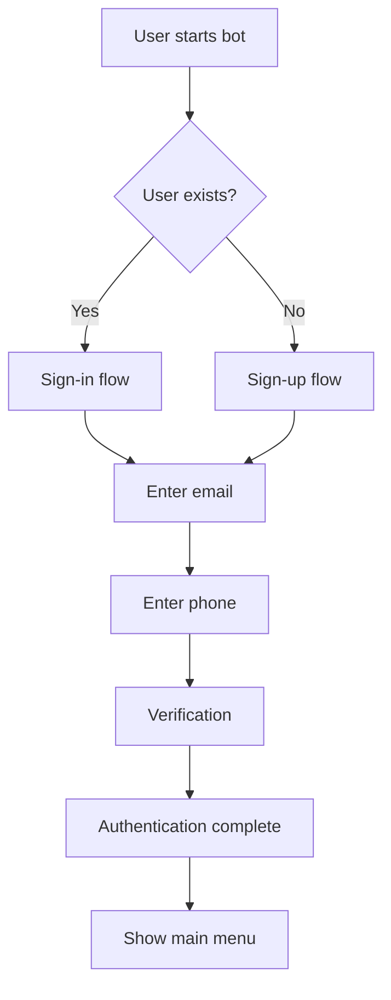
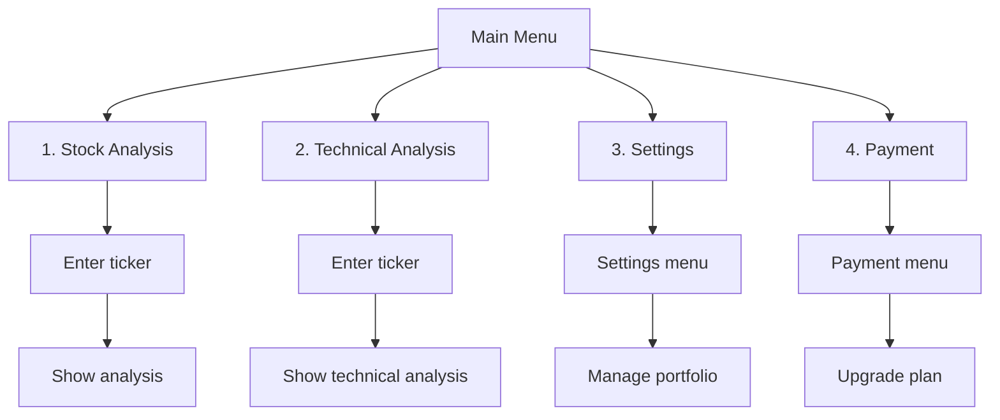

# Telegram Stock Bot

A comprehensive Telegram bot for stock analysis and portfolio management with subscription-based features.

## 📋 Table of Contents

- [Overview](#overview)
- [Architecture](#architecture)
- [Process Flow](#process-flow)
- [Database Schema](#database-schema)
- [Features](#features)
- [Installation](#installation)
- [Configuration](#configuration)
- [Usage](#usage)
- [API Documentation](#api-documentation)
- [Development](#development)

## 🎯 Overview

The Telegram Stock Bot provides users with:
- **Stock Analysis**: Real-time stock analysis and insights
- **Technical Analysis**: Advanced technical indicators and charts
- **Portfolio Management**: Track and manage stock portfolios
- **Subscription Plans**: Tiered access with different features
- **Multi-language Support**: English and Hebrew
- **Event Tracking**: Comprehensive analytics and user behavior tracking

## 🏗️ Architecture

### Core Structure

```
telegram_bot/
├── main.py                 # Entry point, bot initialization
├── config/
│   ├── settings.py         # Bot settings, API keys, database config
│   ├── messages.py         # All user-facing messages (easily configurable)
│   └── plans.py           # Subscription plans configuration
├── handlers/
│   ├── auth_handler.py    # Authentication & user management
│   ├── menu_handler.py    # Main menu & navigation
│   ├── analysis_handler.py # Stock analysis requests
│   ├── settings_handler.py # User settings management
│   └── payment_handler.py # Payment & subscription management
├── services/
│   └── database_service.py # Database operations & data validation
├── utils/
│   ├── validators.py      # Data validation functions
│   └── decorators.py      # Authentication, logging, rate limiting
└── README.md             # This documentation
```

### Key Components

#### 1. **Main Bot (`main.py`)**
- **Purpose**: Entry point and message routing
- **Responsibilities**:
  - Initialize bot and all handlers
  - Route messages to appropriate handlers
  - Handle errors and logging
  - Manage user state and flow

#### 2. **Configuration (`config/`)**
- **`settings.py`**: Environment variables, database config, bot settings
- **`messages.py`**: All user-facing messages in multiple languages
- **`plans.py`**: Subscription plans and feature definitions

#### 3. **Handlers (`handlers/`)**
- **`auth_handler.py`**: User authentication, sign-up/sign-in flow
- **`menu_handler.py`**: Main menu display and navigation
- **`analysis_handler.py`**: Stock and technical analysis
- **`settings_handler.py`**: User settings and portfolio management
- **`payment_handler.py`**: Subscription and payment processing

#### 4. **Services (`services/`)**
- **`database_service.py`**: All database operations with validation

#### 5. **Utilities (`utils/`)**
- **`validators.py`**: Data validation for all inputs
- **`decorators.py`**: Authentication, logging, and rate limiting decorators

## 🔄 Process Flow

### 1. **User Authentication Flow**



**Steps**:
1. **First Connection**: Check if user exists in database
2. **Sign-up/Sign-in**: Collect email and phone number
3. **Verification**: Validate user credentials
4. **Plan Check**: Verify subscription status
5. **Menu Display**: Show appropriate menu based on plan

### 2. **Main Menu Flow**



### 3. **Analysis Flow**

**Stock Analysis**:
1. User selects "Stock Analysis"
2. Bot checks user's tickers
3. If no tickers: prompt for new ticker
4. If tickers exist: show selection menu
5. Validate ticker input
6. Perform analysis (integrate with your analysis service)
7. Display formatted results
8. Log event for analytics

**Technical Analysis**:
1. Check user's plan (premium required)
2. Validate ticker
3. Perform technical analysis
4. Display indicators (RSI, MACD, Moving Averages)
5. Show support/resistance levels

### 4. **Settings Flow**

**Portfolio Management**:
1. Show current tickers
2. Allow adding new tickers (check plan limits)
3. Allow removing tickers
4. Update database with changes

**Weights Management** (Premium only):
1. Check plan access
2. Show current tickers
3. Collect weight percentages
4. Validate total equals 100%
5. Update user weights

### 5. **Payment Flow**

**Plan Management**:
1. Show current plan status
2. Display available upgrades
3. Handle coupon codes
4. Process payments (integrate with payment service)
5. Update user plan in database

## 🗄️ Database Schema

### Core Tables

#### `fact_users_data_table`
- **Primary Key**: `user_id` (VARCHAR)
- **Key Fields**:
  - `telegram_user_id`: Links to Telegram
  - `plan_type`: Current subscription (free/basic/premium/pro)
  - `plan_end_time`: When plan expires
  - `amount_tickers_allowed`: Plan limit
  - `amount_tickers_have`: Current count
  - `tickers`: Comma-separated ticker list
  - `user_weights`: Portfolio weights
  - `status`: active/inactive/suspended

#### `fact_telegram_bot_actions`
- **Purpose**: Event tracking and analytics
- **Key Fields**:
  - `user_id`: Internal user ID
  - `telegram_id`: Telegram user ID
  - `event_type`: Action performed
  - `event_time`: Timestamp
  - `kpi`: Which metric is impacted
  - `before_change`/`after_change`: For settings changes

#### `fact_prodacts_available`
- **Purpose**: Available subscription plans
- **Key Fields**:
  - `product_id`: Plan identifier
  - `product_name`: Display name
  - `price_shown_usd`: Plan price
  - `discount_givin`: Discount percentage
  - `description`: Plan features

## ✨ Features

### Free Plan
- Basic stock analysis
- Daily summary
- Basic charts
- Up to 3 tickers

### Basic Plan ($4.99/month)
- All free features
- Technical indicators
- Email alerts
- Up to 5 tickers

### Premium Plan ($9.99/month)
- All basic features
- Advanced indicators
- Portfolio weights
- Custom alerts
- Priority support
- Up to 10 tickers

### Pro Plan ($19.99/month)
- All premium features
- AI insights
- Backtesting
- API access
- Up to 20 tickers

## 🚀 Installation

### Prerequisites
- Python 3.8+
- MySQL database
- Telegram Bot Token

### Setup

1. **Clone the repository**:
```bash
git clone <repository-url>
cd telegram_bot
```

2. **Install dependencies**:
```bash
pip install -r requirements.txt
```

3. **Set environment variables**:
```bash
export TELEGRAM_BOT_TOKEN="your_bot_token"
export DB_HOST="localhost"
export DB_PORT="3306"
export DB_USER="your_db_user"
export DB_PASSWORD="your_db_password"
export DB_NAME="stock_bot"
```

4. **Run the bot**:
```bash
python main.py
```

## ⚙️ Configuration

### Environment Variables

| Variable | Description | Default |
|----------|-------------|---------|
| `TELEGRAM_BOT_TOKEN` | Telegram bot token | Required |
| `DB_HOST` | Database host | localhost |
| `DB_PORT` | Database port | 3306 |
| `DB_USER` | Database user | root |
| `DB_PASSWORD` | Database password | "" |
| `DB_NAME` | Database name | stock_bot |
| `DEBUG` | Debug mode | False |

### Bot Settings (`config/settings.py`)

```python
BOT_SETTINGS = {
    'max_retry_attempts': 15,
    'cooldown_minutes': 30,
    'session_timeout_minutes': 60,
    'max_tickers_free': 3,
    'max_tickers_premium': 10,
    'default_language': 'en'
}
```

### Messages (`config/messages.py`)

All user-facing messages are centralized and support multiple languages:

```python
MESSAGES = {
    'welcome': {
        'en': "🎉 Welcome to StockBot!",
        'he': "🎉 ברוכים הבאים ל-StockBot!"
    }
}
```

## 📖 Usage

### Starting the Bot

1. **Start the bot**:
```bash
python main.py
```

2. **Bot will**:
   - Initialize database connection
   - Set up all handlers
   - Start polling for messages
   - Log startup information

### User Interaction

1. **First-time users**:
   - Send `/start` to begin
   - Complete sign-up process
   - Get free plan access

2. **Returning users**:
   - Send any message to see menu
   - Navigate through options
   - Access features based on plan

### Daily Messages

The bot can send daily analysis messages:
- Configured in `config/settings.py`
- Uses `FEATURES['daily_messages']` flag
- Integrate with your analysis service

## 🔧 API Documentation

### Database Service

#### User Management
```python
# Get user by Telegram ID
user = await db_service.get_user_by_telegram_id(telegram_id)

# Create new user
success = await db_service.create_user(user_data)

# Update user
success = await db_service.update_user(user_id, updates)

# Check plan status
is_active = await db_service.is_plan_active(user_id)
```

#### Portfolio Management
```python
# Get user's tickers
tickers = await db_service.get_user_tickers(user_id)

# Add ticker
success = await db_service.add_user_ticker(user_id, ticker)

# Remove ticker
success = await db_service.remove_user_ticker(user_id, ticker)
```

#### Event Logging
```python
# Log any event
await db_service.log_event(event_data)
```

### Analysis Handler

#### Stock Analysis
```python
# Perform analysis
analysis = await analysis_handler._perform_stock_analysis(ticker)

# Format results
formatted = analysis_handler._format_stock_analysis(analysis)
```

#### Technical Analysis
```python
# Perform technical analysis
tech_analysis = await analysis_handler._perform_technical_analysis(ticker)

# Format results
formatted = analysis_handler._format_technical_analysis(tech_analysis)
```

## 🛠️ Development

### Adding New Features

1. **Create handler method** in appropriate handler
2. **Add message** in `config/messages.py`
3. **Update routing** in `main.py`
4. **Add validation** in `utils/validators.py`
5. **Log events** for analytics

### Data Validation

All user inputs are validated:

```python
# Validate ticker
if not validate_ticker(ticker):
    return error_message

# Validate email
if not validate_email(email):
    return error_message

# Sanitize input
clean_input = sanitize_input(user_input)
```

### Error Handling

- **Graceful degradation**: Bot continues working even if some features fail
- **User-friendly messages**: Clear error messages in user's language
- **Comprehensive logging**: All errors logged for debugging
- **Rate limiting**: Prevents abuse and ensures stability

### Testing

```bash
# Run tests
python -m pytest tests/

# Test specific handler
python -m pytest tests/test_auth_handler.py
```

### Deployment

1. **Production environment**:
   - Use environment variables for all secrets
   - Set up proper logging
   - Configure database connection pooling
   - Set up monitoring and alerts

2. **Scaling considerations**:
   - Use Redis for session storage
   - Implement database connection pooling
   - Add rate limiting per user
   - Set up horizontal scaling

## 📊 Analytics

The bot tracks comprehensive analytics:

- **User events**: All interactions logged
- **Feature usage**: Which features are most popular
- **Plan conversions**: Free to paid conversions
- **Error tracking**: Failed operations and errors
- **Performance metrics**: Response times and throughput

## 🔒 Security

- **Input validation**: All user inputs validated
- **SQL injection prevention**: Parameterized queries
- **Rate limiting**: Prevents abuse
- **Authentication**: Proper user verification
- **Data sanitization**: Clean all inputs

## 🤝 Contributing

1. Fork the repository
2. Create feature branch
3. Make changes with proper validation
4. Add tests for new features
5. Update documentation
6. Submit pull request

## 📄 License

This project is licensed under the MIT License - see the LICENSE file for details.

## 🆘 Support

For support and questions:
- Check the documentation
- Review the code comments
- Open an issue on GitHub
- Contact the development team

---

**Note**: This bot is designed to integrate with your existing stock analysis services. Replace the placeholder analysis methods with your actual analysis implementations. 